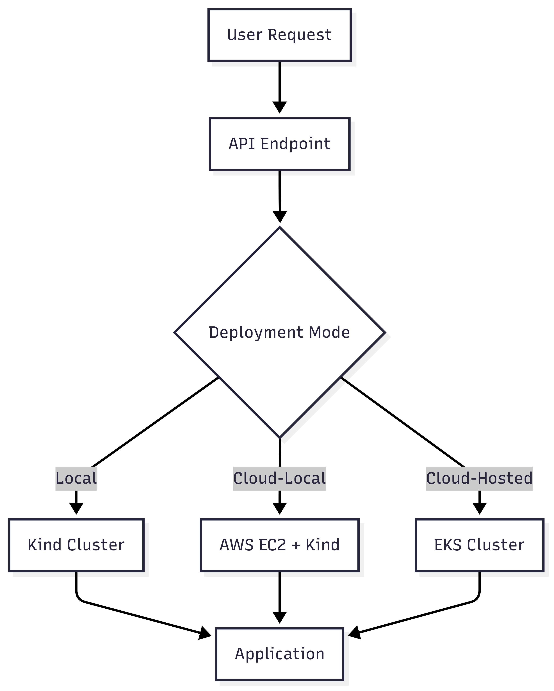

# On-Demand Infrastructure Provision

## Table of Contents
1. [Project Overview](#project-overview)
2. [Architecture](#architecture)
3. [Project Setup](#project-setup)
4. [Configuration](#configuration)
5. [Running the Server](#running-the-server)
6. [Deployment Modes](#deployment-modes)
   - [Local Mode](#local-mode)
   - [Cloud-Local Mode](#cloud-local-mode)
   - [Cloud-Hosted Mode](#cloud-hosted-mode)
7. [Lifecycle Management](#lifecycle-management)
8. [API Reference](#api-reference)
9. [Troubleshooting](#troubleshooting)

## Project Overview
This is a FastAPI application that provides an OpenAI-compatible API to automate infrastructure deployment and application setup across different environments. It supports three deployment modes:
- **Local**: Deploys applications to a local Kind cluster
- **Cloud-Local**: Provisions an EC2 instance and deploys to Kind on AWS
- **Cloud-Hosted**: Deploys to managed EKS clusters with full cloud resources

## Architecture


## Project Setup

### 1.1. Clone the Repository
```bash
git clone https://github.com/faiaz-halim/on-demand-infra.git
cd on-demand-infra
```

### 1.2. Create and Activate a Python Virtual Environment
It's highly recommended to use a virtual environment:
```bash
python -m venv venv
source venv/bin/activate  # On Windows: venv\Scripts\activate
```

### 1.3. Install Dependencies
Install the required Python packages:
```bash
pip install -r requirements.txt
```

## Configuration

Configuration for the application is managed via environment variables, typically loaded from a `.env` file.

### 2.1. Create `.env` File
Copy the example environment file and customize it:
```bash
cp .env.example .env
```
Now, edit the `.env` file with your specific settings.

### 2.2. Key Environment Variables

Ensure the following critical variables are set in your `.env` file:

*   **Azure OpenAI Settings (for LLM integration):**
    *   `AZURE_OPENAI_API_KEY`: Your Azure OpenAI API key.
    *   `AZURE_OPENAI_ENDPOINT`: Your Azure OpenAI endpoint URL (e.g., `https://your-resource-name.openai.azure.com/`).
    *   `AZURE_OPENAI_API_VERSION`: The API version (e.g., `2023-12-01-preview`).
    *   `AZURE_OPENAI_DEPLOYMENT`: Your Azure OpenAI deployment name for chat models.
    *   *(Optional)* `AZURE_EMBEDDING_DEPLOYMENT`, `AZURE_EMBEDDING_API_VERSION` if using embedding features separately.

*   **Application Specific Settings:**
    *   `PERSISTENT_WORKSPACE_BASE_DIR`: (Optional) Path to a directory where application will store persistent Terraform workspaces. Defaults to `/app/app_workspaces` within the container, or `./app_workspaces` if run locally without Docker. Ensure this path is writable by the server process.
    *   `EC2_PRIVATE_KEY_BASE_PATH`: **Essential for Cloud-Local mode.** The absolute path on the server where EC2 private key files (e.g., `.pem` files) are stored. The server will look for `<key_name>.pem` (or just `<key_name>`) within this directory.
    *   `DEFAULT_DOMAIN_NAME_FOR_APPS`: **Required for Cloud-Hosted custom domains.** The base domain name under which application subdomains will be created (e.g., `appapps.yourcompany.com`).
    *   `LOG_LEVEL`: (Optional) Set the application log level (e.g., `INFO`, `DEBUG`). Defaults to `INFO`.

*   **Default AWS Settings (Optional - can be overridden by request-specific credentials):**
    *   `AWS_ACCESS_KEY_ID`: Default AWS Access Key ID.
    *   `AWS_SECRET_ACCESS_KEY`: Default AWS Secret Access Key.
    *   `AWS_REGION`: Default AWS Region (e.g., `us-east-1`).

*   **Other Defaults:**
    *   The server uses various default settings for Kind, EC2, EKS, etc., defined in `app/core/config.py`. These can typically be left as is unless specific adjustments are needed for your environment.

## Running the Server

Once the setup and configuration are complete, you can run the application using Uvicorn:

```bash
python -m uvicorn app.main:app --host 0.0.0.0 --port 8000 --reload --log-config log_config.yaml
```

*   `--host 0.0.0.0`: Makes the server accessible from outside its container/machine.
*   `--port 8000`: Specifies the listening port.
*   `--reload`: Enables auto-reloading when code changes (useful for development).

The API will then be available at `http://localhost:8000` (or your server's IP/hostname). The OpenAI compatible endpoint is at `/v1/chat/completions`.

## Deployment Modes

Interaction with the application is primarily through its OpenAI-compatible API endpoint: `POST /v1/chat/completions`.
The request body should be a JSON object adhering to the `ChatCompletionRequest` schema (see `app.core.schemas.py` for details, or refer to OpenAI's chat completion API, with added APP-specific fields).

Below are example `curl` commands to test the `deploy` action for each mode. You'll need to replace placeholder values (like `<YOUR_...>`, repository URLs) with your actual data.

**Important Note on `instance_name` vs. `instance_id`:**
*   `instance_name`: A user-defined friendly name for an instance. Used for tagging AWS resources (like EC2 instances, EKS clusters) and can be helpful for identifying deployments. For some lifecycle actions (like scaling cloud-hosted), this `instance_name` is expected to be the Kubernetes deployment name.
*   `instance_id`:
    *   For **Cloud-Local**: This is the EC2 instance tag (`Name` tag) that was used or generated during deployment. It's returned in the deploy response and is required for lifecycle actions like redeploy, scale, decommission.
    *   For **Cloud-Hosted**: This is the EKS cluster name that was used or generated. It's returned in the deploy response and is required for lifecycle actions.

### Local Mode

**Prerequisites:**
*   Docker Desktop (or Docker daemon) installed and running.
*   `kind` CLI installed.
*   `kubectl` CLI installed.

**Example `curl` command:**
```bash
curl -X POST http://localhost:8000/v1/chat/completions \
-H "Content-Type: application/json" \
-d '{
  "model": "app-server-default",
  "messages": [
    {"role": "user", "content": "Deploy my simple web app."}
  ],
  "action": "deploy",
  "deployment_mode": "local",
  "github_repo_url": "https://github.com/your_group/app-server-test-repo.git",
  "target_namespace": "my-local-app"
}'
```

**Expected Outcome:**
*   The application will (if not already present) create a local Kind cluster (default name: `on-demand-infra`).
*   It will clone the repository, attempt to find a Dockerfile, and build a Docker image locally.
*   The image will be loaded into the Kind cluster.
*   Kubernetes manifests (Deployment, Service) will be generated and applied to the `my-local-app` namespace in the Kind cluster.
*   The response will indicate success and may provide details on how to access the application (likely via a NodePort service on localhost).

### Cloud-Local Mode

**Prerequisites:**
*   AWS Credentials configured in your `.env` file (for the application itself, if `EC2_PRIVATE_KEY_BASE_PATH` needs resolution) or provided in the request.
*   An existing EC2 Key Pair in your target AWS region. The private key file (e.g., `my-key.pem`) must be accessible to the application at the path configured by `EC2_PRIVATE_KEY_BASE_PATH`.

**Example `curl` command:**
```bash
curl -X POST http://localhost:8000/v1/chat/completions \
-H "Content-Type: application/json" \
-d '{
  "model": "app-server-default",
  "messages": [
    {"role": "user", "content": "Deploy my web app to a cloud-local environment."}
  ],
  "action": "deploy",
  "deployment_mode": "cloud-local",
  "github_repo_url": "https://github.com/your_group/app-server-test-repo.git",
  "target_namespace": "my-app-cl",
  "instance_name": "my-test-ec2-instance",
  "ec2_key_name": "<YOUR_EC2_KEY_PAIR_NAME>",
  "aws_credentials": {
    "aws_access_key_id": "<YOUR_AWS_ACCESS_KEY_ID>",
    "aws_secret_access_key": "<YOUR_AWS_SECRET_ACCESS_KEY>",
    "aws_region": "<YOUR_AWS_REGION>"
  }
}'
```

**Expected Outcome:**
*   An EC2 instance will be provisioned by Terraform using default or specified settings.
*   The EC2 instance will be bootstrapped with Docker, Kind, and Kubectl.
*   The specified repository will be cloned onto the EC2 instance.
*   A Docker image will be built on the EC2 instance.
*   The image will be loaded into the Kind cluster running on the EC2 instance.
*   Kubernetes manifests (Deployment, NodePort Service) will be applied to the Kind cluster.
*   The response will include the `instance_id` (EC2 instance tag, e.g., `my-test-ec2-instance`), the public IP of the EC2 instance, and an application URL (e.g., `http://<public_ip>:<node_port>`).
*   You can use the returned `instance_id`, `public_ip`, and `ec2_key_name` for lifecycle actions like `redeploy`, `scale`, or `decommission`.

### Cloud-Hosted Mode

**Prerequisites:**
*   AWS Credentials with permissions to create ECR repositories, EKS clusters, VPCs, and related resources.
*   (Optional, for custom domain/SSL) A Route53 Public Hosted Zone ID for your base domain (e.g., for `example.com`).
*   (Optional, for custom domain/SSL) The `DEFAULT_DOMAIN_NAME_FOR_APPS` environment variable configured on the application (e.g., `apps.example.com`).

**Example `curl` command (without custom domain):**
```bash
curl -X POST http://localhost:8000/v1/chat/completions \
-H "Content-Type: application/json" \
-d '{
  "model": "app-server-default",
  "messages": [
    {"role": "user", "content": "Deploy my web app to a managed EKS cluster."}
  ],
  "action": "deploy",
  "deployment_mode": "cloud-hosted",
  "github_repo_url": "https://github.com/your_group/app-server-test-repo.git",
  "target_namespace": "my-app-eks",
  "instance_name": "my-eks-app-deployment",
  "aws_credentials": {
    "aws_access_key_id": "<YOUR_AWS_ACCESS_KEY_ID>",
    "aws_secret_access_key": "<YOUR_AWS_SECRET_ACCESS_KEY>",
    "aws_region": "<YOUR_AWS_REGION>"
  }
}'
```

**Example `curl` command (WITH custom domain/SSL):**
```bash
curl -X POST http://localhost:8000/v1/chat/completions \
-H "Content-Type: application/json" \
-d '{
  "model": "app-server-default",
  "messages": [
    {"role": "user", "content": "Deploy my web app to EKS with a custom domain."}
  ],
  "action": "deploy",
  "deployment_mode": "cloud-hosted",
  "github_repo_url": "https://github.com/your_group/app-server-test-repo.git",
  "target_namespace": "my-app-eks-ssl",
  "instance_name": "my-eks-app-ssl",
  "aws_credentials": {
    "aws_access_key_id": "<YOUR_AWS_ACCESS_KEY_ID>",
    "aws_secret_access_key": "<YOUR_AWS_SECRET_ACCESS_KEY>",
    "aws_region": "<YOUR_AWS_REGION>"
  },
  "base_hosted_zone_id": "<YOUR_ROUTE53_HOSTED_ZONE_ID>",
  "app_subdomain_label": "my-app"
}'
```

**Expected Outcome (Cloud-Hosted):**
*   An ECR repository will be created.
*   An EKS cluster (with VPC, node groups, etc.) will be provisioned by Terraform. This can take 15-25 minutes.
*   The specified repository will be cloned locally (or the server).
*   A Docker image will be built locally and pushed to the ECR repository.
*   A Kubeconfig for the EKS cluster will be generated.
*   Nginx Ingress Controller will be installed into the EKS cluster via Helm.
*   If domain details were provided, Terraform will set up an ACM certificate and Route53 alias records.
*   Kubernetes manifests (Deployment, ClusterIP Service, Ingress if custom domain) will be applied to EKS.
*   The response will include the `instance_id` (EKS cluster name), ECR repository URL, EKS endpoint, and the application URL (HTTPS if custom domain was set up, otherwise HTTP to the NLB).
*   You can use the `instance_id` (cluster name) and `instance_name` (deployment name) for lifecycle actions like `redeploy`, `scale`, or `decommission`.

## Lifecycle Management
The application supports the following lifecycle actions for deployed applications:
- **Redeploy**: Update application with new changes
- **Scale**: Adjust replica count for deployments
- **Decommission**: Tear down deployed resources

Example redeploy command:
```bash
curl -X POST http://localhost:8000/v1/chat/completions \
-H "Content-Type: application/json" \
-d '{
  "model": "app-server-default",
  "messages": [{"role": "user", "content": "Redeploy my application"}],
  "action": "redeploy",
  "deployment_mode": "cloud-hosted",
  "instance_id": "my-eks-cluster",
  "github_repo_url": "https://github.com/your_group/app-server-test-repo.git"
}'
```

## API Reference
### POST /v1/chat/completions
**Parameters:**
- `model` (string): Must be "app-server-default"
- `messages` (array): Conversation history
- `action` (string): One of ["deploy", "redeploy", "scale", "decommission"]
- `deployment_mode` (string): One of ["local", "cloud-local", "cloud-hosted"]
- `github_repo_url` (string): URL of application repository
- `target_namespace` (string): Kubernetes namespace
- `instance_name` (string): User-defined name for deployment
- `instance_id` (string): Required for lifecycle operations
- `ec2_key_name` (string): Required for cloud-local mode
- `aws_credentials` (object): AWS credentials
- `base_hosted_zone_id` (string): Route53 hosted zone ID for custom domains
- `app_subdomain_label` (string): Subdomain label for application

## Troubleshooting
**Common Issues:**
1. **EC2 key not found**: Ensure private key is in `EC2_PRIVATE_KEY_BASE_PATH`
2. **Kind cluster fails to start**: Verify Docker is running and has sufficient resources
3. **EKS creation timeout**: EKS clusters take 15-25 minutes to provision
4. **Permission errors**: Check AWS credentials and IAM policies
